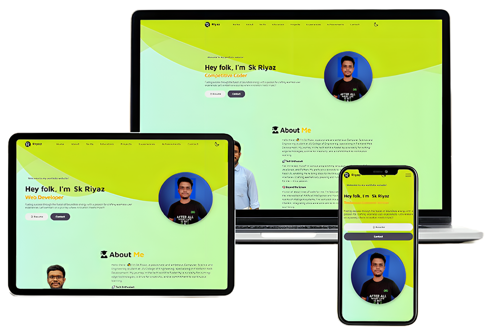

<h1 align="center"> Personal Portfolio Website  
<a href="https://skriyaz.netlify.app/" target="_blank">skriyaz.netlify.app</a></h1>

This repository contains the code for my personal portfolio website, showcasing my skills, projects, and experiences in computer science and engineering. The website features a modern design, interactive elements, and responsive layouts for seamless viewing on different devices. Explore my work and background through this professional online platform.

  

## Tech Stack ⚙

This project has been developed using the following technologies.
- HTML5
- CSS
- Node.js
- Bootstrap
- SASS

## Features 🎭

- Light/dark mode toggle 
- Fully Responsive
- Fullscreen mode
- Styled with React-Bootstrap and Css with easy to customize colors

## Sections 📚

✔️ About me\
✔️ Skills & Abilities \
✔️ Education & Trainings\
✔️ Projects\
✔️ Experiences\
✔️ Certifications & Achievements🏆\
✔️ Contact me

## Badges 🎖

 &nbsp;
 &nbsp;

 &nbsp;
 &nbsp;
 &nbsp;
 &nbsp;
&nbsp;

## Author ✍

<a href="https://github.com/riyaz-02"> <h3 align="center">Sk Riyaz</h3></a> 

 &nbsp;
 &nbsp;
 &nbsp;
&nbsp;

